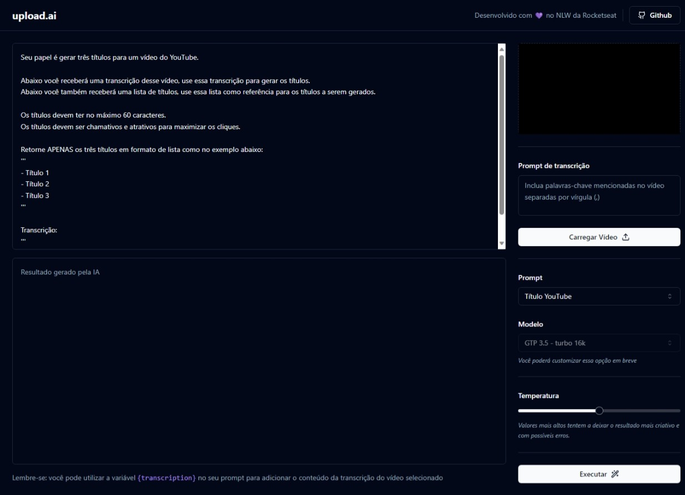

# Upload.ai
Gere a transcrição de um vídeo utilizando o modelo de IA Whisper da OpenAI e a partir de prompts prontos gere a descrição ou o título para um vídeo do YouTube a partir da transcrição gerada utilizando o ChatGPT.

O vídeo é convertido no back-end para áudio, isso permite que seja possível enviar conteúdos um pouco mais longos para o Whisper. Depois de gerada, a transcrição é armazenada no banco de dados e no momento de enviar o prompt para o ChatGPT é feito a busca no banco de dados.



## ✨ Tecnologias
### Front-end
- React.js | Vite | TypeScript | TailwindCSS | axios | lucid-react | shadcn-ui | ffmpeg for WebAssembly | Vercel AI SDK
### Back-end
- TypeScript | Fastify | Prisma | zod | openai

## 💻 Uso
Crie sua aplicação através do Github e preencha as variáveis ambientes em um arquivo chamado .env.
Depois, em seu terminal:
```bash
# Clone o repositório
git clone https://github.com/ViGF/nlw-ai.git
# Acesse a pasta back-end do projeto
cd nlw-ai/server
# Instale as dependências
pnpm i
# Execute a aplicação
pnpm dev
```
```bash
# Em outra janela do seu terminal acesse a pasta do front-end do projeto
cd nlw-ai/web
# Instale as dependências
pnpm i
# Execute a aplicação
pnpm dev
# Agora basta acessa-la
```